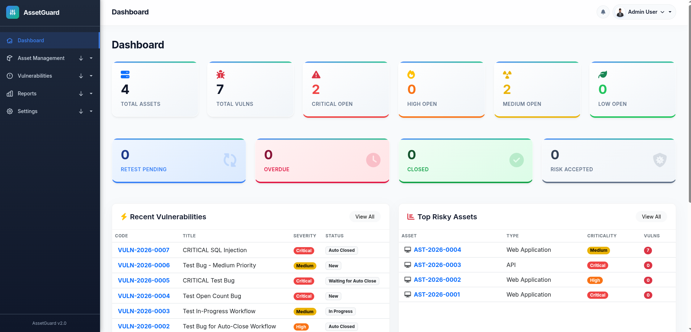

# AssetGuard


<p align="center">
  
</p>

Cybersecurity Asset, Bug & Vulnerability Tracking System

## Overview
AssetGuard is a comprehensive web-based platform designed for modern Security Operations Centers (SOCs). It enables security teams to seamlessly report vulnerabilities, track remediation progress across software teams, and manage retest workflows across multiple assets.

## Quick Links / Documentation

All detailed documentation has been organized into our `docs/` folder. Please refer to the specific guides below:

- 🚀 **[Features & Modules](docs/features.md)**: Explore the core Django apps, security integrations, and performance optimizations.
- 👥 **[Workflows & Roles](docs/workflows.md)**: Learn about the 5 RBAC roles, the vulnerability lifecycle, SLA policies, and how Asset Risk Scores are dynamically calculated.
- 🏗️ **[Architecture & Models](docs/architecture.md)**: Understand the database schema and URL routing structure.
- ⚙️ **[Deployment & Troubleshooting](docs/deployment_and_troubleshooting.md)**: Find instructions on configuration, Gunicorn/systemd deployment, and debugging common issues.

## Technology Stack
- **Backend**: Python 3.12+ | Django 5.x
- **Frontend**: HTML5 | CSS3 | Vanilla JavaScript | Bootstrap 5 (Glassmorphic Enterprise UI)
- **Database**: SQLite (Dev) | PostgreSQL (Production)
- **Server**: Django Dev Server (Dev) | Gunicorn + Nginx (Prod)

## Quick Start Installation

1. **Clone the repository**
```bash
git clone https://github.com/boniyeamincse/assetguard.git
cd assetguard
```

2. **Create and activate a virtual environment**
```bash
python3 -m venv venv
source venv/bin/activate  # On Windows: venv\Scripts\activate
```

3. **Install dependencies**
```bash
pip install -r requirements.txt
```

4. **Setup Environment Variables**
Copy the example file and configure your `.env`:
```bash
cp .env.example .env
```

5. **Run migrations and seed demo data**
```bash
python manage.py migrate
python manage.py seed_data
```

6. **Create a superuser & Run server**
```bash
python manage.py createsuperuser
python manage.py runserver
```

## Contributing

We welcome contributions from the open-source community! If you'd like to help improve AssetGuard, please read our [Contributing Guide](CONTRIBUTING.md) for details on our code of conduct, and the process for submitting pull requests to us.

## License

This project is licensed under the MIT License - see the [LICENSE](LICENSE) file for details.

---

**Built with**: Django 5.1.6, Bootstrap 5.3.0
